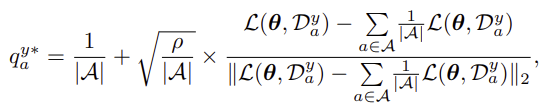

# Fairness

### Re-Weighting Based Group Fairness Regularization via Classwise Robust Optimization ([ICLR 2023](https://openreview.net/pdf?id=Q-WfHzmiG9m))

* FairDRO
* apply Group DRO separately for each class
* 
* .png>)
* .png>)
* .png>)

### FairBatch: Batch Selectino for Model Fairness ([ICLR 2021](https://arxiv.org/pdf/2012.01696.pdf))

* Batch selection with respect to sensitive groups can change be a fairness technique
* Bilevel Optimization for Fairness:
  * 

### Sample Selection for Fair and Robust Training ([NIPS 2021](https://papers.nips.cc/paper/2021/file/07563a3fe3bbe7e3ba84431ad9d055af-Paper.pdf))

* Clean Selection ([Y.shen et al. ICML'19](https://arxiv.org/pdf/1810.11874.pdf))
  * Clean Selection itself can induce unfairness
  * Use FairBatch with clean selection.

### Agnostic Federated Learning ([ICML 2019](https://arxiv.org/pdf/1902.00146.pdf))

* The centralized model is optimized for any possible target distribution formed by a mixture of client distributrions.
* Fairness-Constrained min-max problem

### Addressing Algorithmic Disparity and Performance Inconsistency in Federated Learning ([NIPS 2021](https://arxiv.org/pdf/2108.08435.pdf))

* Enforcing both algorithmic fairness and performance consistency across clients

### Diverse Client Selection For Federated Learning via Submodular Maximization ([ICLR 2022](https://openreview.net/pdf?id=nwKXyFvaUm))

### Fair Resource Allocation In Federated Learning([ICLR 2020](https://arxiv.org/pdf/1905.10497))

* problem: Fairness in Federated Learning
* Fairness?:
  * 
  * performance: accuracy of model to each devices test data
  * uniformity: variance
* FL objective
  * FedAvg Objective:
    * 
  * q-FFL Objective:
    * 
    * $\alpha$-fairness approach (widely used in resource allocation)
    * q = 0, same as FedAvg Objective
    * q $\rightarrow \infty$, same as Fairness Constrained min-max approach(Agnostic Federated Learning)
    * tune q at a adequate level of fairness and performance tradeoff
* q-FFL (q-FedAvg)
  * 
  * L: step size, F: cost function
  * what is h?
    * To keep the step size to L (Lipschitz constant of the function's gradient)
    * 
    * upper bound, proven in Lemma 3. in the paper
  * key idea:
    * use loss as aggregation weight
    * loss as power of q to generalize the method (tune for tradeoff between fairness and performance)
